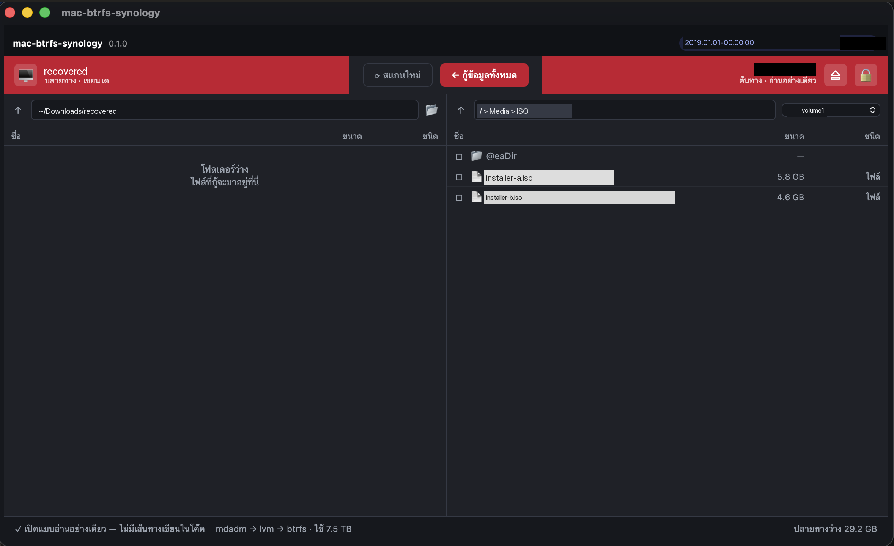

# Synology Vault Recover

Pull your files off a Synology NAS drive on a Mac — no NAS, no Linux, no VM.

When a Synology DiskStation dies, the drives still hold your data. But macOS
cannot read them: Synology stacks **mdadm RAID → LVM → Btrfs**, and macOS has
none of those. The usual advice is to build a Linux VM and learn `btrfs restore`.

This app reads that stack natively on macOS and gives you a two-pane file
browser. Pick your files, right-click, download. That's it.



*Left: where files land. Right: the Synology volume, read-only. Names in this
screenshot are placeholders.*

---

## Status

**Working, early.** It reads real Synology disks and copies real files out.
It is not signed or notarized yet, so you build it yourself for now (see below).

| Works | Not yet |
|---|---|
| Single-disk SHR / RAID1 volumes | RAID 0 / 5 / 6 / 10 (needs all member disks) |
| Browsing subvolumes and folders | Compressed files (zlib/lzo/zstd) |
| Copying files and whole folders | Encrypted shared folders |
| Resume-friendly overwrite rules | Signed release build |

If a file uses Btrfs compression, the app **tells you it cannot decode it**
rather than writing a corrupt file. That is deliberate.

---

## Safety

This is a recovery tool, so the source disk is treated as read-only at every
level — not by convention, but by construction:

- The source is opened with `O_RDONLY`. The reader crate has **no write path
  at all**, so a stray write cannot even compile against it.
- Elevation goes through macOS's own `/usr/libexec/authopen`, requesting the
  `sys.openfile.readonly` right. The kernel hands back a descriptor that
  cannot be written to, even by mistake.
- Nothing is mounted, repaired, or modified. No `fsck`, no `btrfs check`,
  no metadata rewrite.

Copies always go **one way**: from the NAS disk to a folder you choose.

---

## Install

You need a Mac (Apple Silicon or Intel), macOS 14+, and the NAS drive in a
USB dock or enclosure.

```bash
# 1. Install Rust and the Tauri CLI
curl --proto '=https' --tlsv1.2 -sSf https://sh.rustup.rs | sh
cargo install tauri-cli --version "^2" --locked

# 2. Build the app
git clone https://github.com/srayuth089/synology-vault-recover.git
cd synology-vault-recover/crates/app
cargo tauri build --bundles app

# 3. Open it
open ../../target/release/bundle/macos/*.app
```

Prebuilt `.app` bundles are attached to
[Releases](https://github.com/srayuth089/synology-vault-recover/releases)
when available.

---

## Using it

1. Plug in the Synology drive. **If macOS asks to initialise or repair it,
   click Ignore** — never Initialize.
2. Open the app. The right pane lists Synology disks it recognises.
3. Click a disk. macOS shows its standard password prompt (the app needs
   permission to read the raw device). Enter it once.
4. Pick a shared folder from the dropdown — `photo`, `video`, `Documents`,
   and so on. Synology's own internal subvolumes are hidden by default.
5. Browse to what you want. Tick the checkboxes to select several items.
6. Right-click → **Download**, or use the Recover button.

The left pane is an ordinary folder browser that starts in `~/Downloads`.
That is where files land unless you choose somewhere else.

### If a file already exists

The app checks the destination before it writes anything, and only asks when
there is something to decide:

- **Overwrite only if different** *(recommended)* — compares file sizes and
  skips anything that already matches. This makes an interrupted recovery
  safe to simply re-run.
- **Skip existing** — never touch what is already there.
- **Overwrite everything.**

---

## How it works

macOS sees a Synology drive as an unreadable `Linux_RAID` partition. Underneath
are three layers, each of which this project reads directly:

```
/dev/rdiskNsM
  └── mdadm RAID superblock (v1.x)   → where the array's data begins
      └── LVM2 physical volume        → which extents belong to the volume
          └── Btrfs filesystem        → subvolumes, directories, file extents
```

Everything is parsed from the published on-disk formats. There is no
`btrfs-progs`, no kernel module, and no GPL code in this repository — which is
also why it can be MIT licensed.

### The Synology quirk

Stock Btrfs refuses Synology volumes outright:

```
invalid root flags, have 0x400000000 expect mask 0x1000000000001
```

Synology sets private flag bits that upstream does not know about. The common
workaround found online is to comment out the check entirely — which also
disables the corruption detection that check exists for.

This project instead keeps the check and widens the mask by exactly the bits
that have been observed on real hardware (33, 34, 35). Anything else still
fails safe, with diagnostics. See
[`crates/protocol/src/flags.rs`](crates/protocol/src/flags.rs).

---

## Layout

```
crates/
├── reader/     Read-only parsers: mdadm, LVM2, Btrfs. No dependencies on
│               the UI, and no write path anywhere in it.
├── protocol/   Shared types, plus the Synology flag policy.
└── app/        Tauri desktop app — Rust backend in src/, UI in ui/.
```

Run the test suite with:

```bash
cargo test
```

There is also a CLI probe for inspecting a disk's three layers without the UI,
which is handy when something does not parse:

```bash
sudo cargo run -p mbs-reader --example probe /dev/rdisk5s5
```

---

## Contributing

Contributions are welcome — especially the gaps listed under *Not yet* above.

A few things worth knowing before you start:

- **The reader must stay read-only.** `ReadOnlyDevice` exposes no write
  method on purpose. Please keep it that way.
- **Never widen the Btrfs flag mask on a hunch.** A bit gets added only when
  it has been seen on a real disk and a test covers it. There is a comment
  block in `flags.rs` explaining the evidence tiers.
- **Parsers should fail, not guess.** If a structure looks wrong, return an
  error with enough detail to debug it. Silently reading the wrong offset is
  how recovery tools corrupt data.
- Tests are plain `cargo test` and use synthetic fixtures, so you do not need
  a Synology disk to work on most of the code.

Compression support (zlib, lzo, zstd) is the single most useful thing anyone
could add — Synology enables it on many volumes, and files that use it
currently cannot be extracted.

---

## Credits and prior art

The on-disk formats were implemented from public documentation and from
reading the upstream sources for reference:
[btrfs-progs](https://github.com/kdave/btrfs-progs),
[mdadm](https://github.com/md-raid-utilities/mdadm), and
[LVM2](https://github.com/lvmteam/lvm2). No code was copied from them.

## License

MIT — see [LICENSE](LICENSE).
